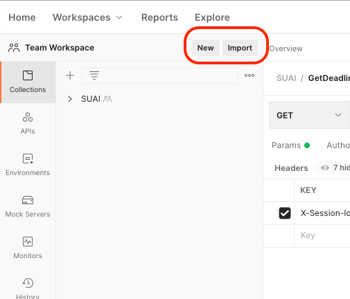

Примеры представлены в виде curl запроса и raw ответа.

Для импорта curl запроса в Postman
1) нажмите кнопку import

2) выберете Raw text

3) Импортируйте


Авторизайия
---
```
curl --location --request POST 'https://restfulapi.ru/api/v2/auth/FSPO' \
--header 'Content-Type: application/json' \
--data-raw '{
    "serviceLogin": "login",
    "servicePassword": "password"
}'

[Response]
HTTP/1.1 201 
Server: nginx/1.21.1
Date: Thu, 09 Sep 2021 16:10:23 GMT
Content-Type: application/json
Transfer-Encoding: chunked
Expires: 0
Cache-Control: no-cache
Connection: keep-alive

{"result":{"sessionId":"9ee23b268caf0981639b40746bbb1becab13cad31363b71f49157bffac4961dc","user":{"university":{"referenceDate":1630735348,"referenceWeek":"odd","_id":"FSPOITMO","name":"ФСПО ИТМО","serviceName":"fspo.ifmo"},"adsEnabled":false,"isAdsEnabled":false,"_id":"2b86622a3da042c93fced9e42f400eb5f2db76aabf0969a01a0efca3fab7275e","serviceLogin":"login","servicePassword":"pass","firstName":"Тест","lastName":"Тест","avatarURL":null,"vkId":null,"scheduleUser":{"_id":"cf10296631fbda039a31ae689f7f309c398c478e8cdeb66b5e810a7ac8a88b62","name":"Y2432","university":{"referenceDate":1630735348,"referenceWeek":"odd","_id":"FSPOITMO","name":"ФСПО ИТМО","serviceName":"fspo.ifmo"}}}},"error":null}
```

Список групп ФСПО
---
```
curl --location --request GET 'https://restfulapi.ru/api/v2/universities/FSPO/groups?offset=0&limit=20&sort=-name'


[Response]
HTTP/1.1 200 
Server: nginx/1.21.1
Date: Thu, 09 Sep 2021 16:12:41 GMT
Content-Type: application/json
Transfer-Encoding: chunked
Expires: 0
Cache-Control: no-cache
Connection: keep-alive

{"result":{"totalCount":0,"items":[{"_id":"a4c98addf0824786a00cb2ea6dd96937eb7e345f59701b3f8271a6710dfd3287","name":"Y2438","university":{"referenceDate":1630735348,"referenceWeek":"odd","_id":"FSPOITMO","name":"ФСПО ИТМО","serviceName":"fspo.ifmo"}},{"_id":"e513997db0aa2946f23dcac923527b3981fcdbb866779342f87cd5064d4d27fa","name":"Y2437","university":{"referenceDate":1630735348,"referenceWeek":"odd","_id":"FSPOITMO","name":"ФСПО ИТМО","serviceName":"fspo.ifmo"}},{"_id":"b58698d90b0f5e076e348f3db5d130701f47ce0b72be191ff13a284a3ef8b3a7","name":"Y2436","university":{"referenceDate":1630735348,"referenceWeek":"odd","_id":"FSPOITMO","name":"ФСПО ИТМО","serviceName":"fspo.ifmo"}},{"_id":"f59116dc3a9cd63cf133cc2dbfcd82b142eef8b37305b37ee1e0fed3408fe082","name":"Y2435","university":{"referenceDate":1630735348,"referenceWeek":"odd","_id":"FSPOITMO","name":"ФСПО ИТМО","serviceName":"fspo.ifmo"}},{"_id":"a6c1491eac6f023ae01e6db31d73923c4ce3f895dd8dd580b303359660066267","name":"Y2434","university":{"referenceDate":1630735348,"referenceWeek":"odd","_id":"FSPOITMO","name":"ФСПО ИТМО","serviceName":"fspo.ifmo"}},{"_id":"4c375a650d221d1d9652cb3024bffa6ef60595d89b63a304db392e47bee816a8","name":"Y2433","university":{"referenceDate":1630735348,"referenceWeek":"odd","_id":"FSPOITMO","name":"ФСПО ИТМО","serviceName":"fspo.ifmo"}},{"_id":"cf10296631fbda039a31ae689f7f309c398c478e8cdeb66b5e810a7ac8a88b62","name":"Y2432","university":{"referenceDate":1630735348,"referenceWeek":"odd","_id":"FSPOITMO","name":"ФСПО ИТМО","serviceName":"fspo.ifmo"}},{"_id":"a49236c8e4be6007aede5afeac9a9ef495bf29eaf3e95da3972e5101a1b50c74","name":"Y2431","university":{"referenceDate":1630735348,"referenceWeek":"odd","_id":"FSPOITMO","name":"ФСПО ИТМО","serviceName":"fspo.ifmo"}}]},"error":null}

```


Создание дедлайна
---
```
curl --location --request POST 'https://restfulapi.ru/api/v2/deadlines' \
--header 'X-Session-Id: 9ee23b268caf0981639b40746bbb1becab13cad31363b71f49157bffac4961dc' \
--header 'Content-Type: application/json' \
--data-raw '{
    "title": "Это мой двенадцатый дедлайн",
    "description": "Пока без описания, впредь осторожнее",
    "date": 1628764738
}'

[Response]
HTTP/1.1 201 
Server: nginx/1.21.1
Date: Thu, 09 Sep 2021 16:22:47 GMT
Content-Type: application/json
Transfer-Encoding: chunked
Expires: 0
Cache-Control: no-cache
Connection: keep-alive

{"result":{"description":"Пока без описания, впредь осторожнее","subject":null,"closed":false,"external":false,"_id":"178b6b3d75ba254729d368500bbc5c03630513c2396f45b118b3dffe567be1ff","title":"Это мой двенадцатый дедлайн","endDate":1628764738,"startDate":1631204566,"isClosed":false,"isExternal":false},"error":null}
```

Редактирование дедлайна
---
добавили предмет
```
curl --location --request PUT 'https://restfulapi.ru/api/v2/deadlines/178b6b3d75ba254729d368500bbc5c03630513c2396f45b118b3dffe567be1ff' \
--header 'X-Session-Id: 9ee23b268caf0981639b40746bbb1becab13cad31363b71f49157bffac4961dc' \
--header 'Content-Type: application/json' \
--data-raw '{
    "subjectId": "d1b14bf4f529a8e650481b24f6d34080da4ec24f673bf46845434b6e31f7c825"
}'

[Response]
HTTP/1.1 200 
Server: nginx/1.21.1
Date: Thu, 09 Sep 2021 16:27:03 GMT
Content-Type: application/json
Transfer-Encoding: chunked
Expires: 0
Cache-Control: no-cache
Connection: keep-alive

{"result":{"description":"Пока без описания, впредь осторожнее","subject":{"name":"ПП.11.01 Производственная практика (по профилю специальности)","_id":"d1b14bf4f529a8e650481b24f6d34080da4ec24f673bf46845434b6e31f7c825"},"closed":false,"external":false,"_id":"178b6b3d75ba254729d368500bbc5c03630513c2396f45b118b3dffe567be1ff","title":"Это мой двенадцатый дедлайн","endDate":1628764738,"startDate":1631204566,"isClosed":false,"isExternal":false},"error":null}
```

Закрытие дедлайна
---
```
curl --location --request POST 'https://restfulapi.ru/api/v2/deadlines/178b6b3d75ba254729d368500bbc5c03630513c2396f45b118b3dffe567be1ff/close' \
--header 'X-Session-Id: 9ee23b268caf0981639b40746bbb1becab13cad31363b71f49157bffac4961dc'

[Response]
HTTP/1.1 200 
Server: nginx/1.21.1
Date: Thu, 09 Sep 2021 16:28:28 GMT
Content-Type: application/json
Transfer-Encoding: chunked
Expires: 0
Cache-Control: no-cache
Connection: keep-alive

{"result":{"description":"Пока без описания, впредь осторожнее","subject":null,"closed":true,"external":false,"_id":"178b6b3d75ba254729d368500bbc5c03630513c2396f45b118b3dffe567be1ff","title":"Это мой двенадцатый дедлайн","endDate":1628764738,"startDate":1631204566,"isClosed":true,"isExternal":false},"error":null}
```

Удаление дедлайна
---
```
curl --location --request DELETE 'https://restfulapi.ru/api/v2/deadlines/178b6b3d75ba254729d368500bbc5c03630513c2396f45b118b3dffe567be1ff' \
--header 'X-Session-Id: 9ee23b268caf0981639b40746bbb1becab13cad31363b71f49157bffac4961dc'

[Response]
HTTP/1.1 200 
Server: nginx/1.21.1
Date: Thu, 09 Sep 2021 16:29:21 GMT
Content-Type: application/json
Transfer-Encoding: chunked
Expires: 0
Cache-Control: no-cache
Connection: keep-alive

{"result":{"description":"Пока без описания, впредь осторожнее","subject":{"name":"ПП.11.01 Производственная практика (по профилю специальности)","_id":"d1b14bf4f529a8e650481b24f6d34080da4ec24f673bf46845434b6e31f7c825"},"closed":true,"external":false,"_id":"178b6b3d75ba254729d368500bbc5c03630513c2396f45b118b3dffe567be1ff","title":"Это мой двенадцатый дедлайн","endDate":1628764738,"startDate":1631204566,"isClosed":true,"isExternal":false},"error":null}
```
